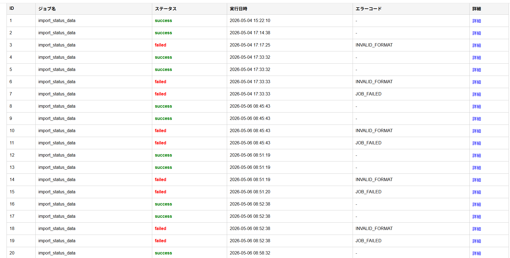
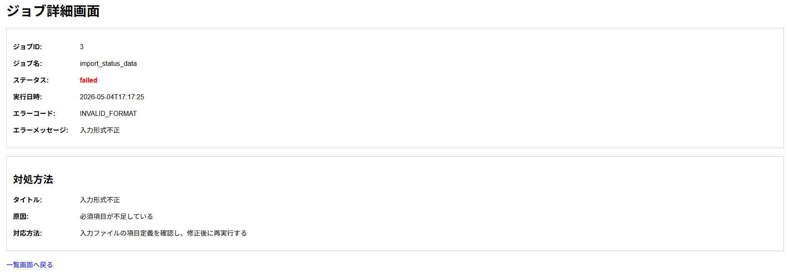

# Job Monitoring & Error Management System

### 業務で行っていたジョブ監視・障害対応・運用改善を、再現可能な形で抽象化したポートフォリオ

Python / Go / SQLite / HTML / Docker を用いて、  
ジョブ実行結果の確認・障害履歴管理・対応ナレッジ可視化を行うシステムを構築しました。

## このポートフォリオの目的

実務では、ジョブ監視・障害管理・運用改善に関わる中で、以下のような業務を経験してきました。

- ジョブ実行結果の確認
- エラー発生時の一次切り分け
- 障害履歴の管理
- 対応手順のナレッジ化
- 運用工数削減のための改善提案

一方で、実際の業務システムは企業固有の環境や機密情報を含むため、そのまま外部へ公開することはできません。

そのため本ポートフォリオでは、実務で行っていた改善業務の構造を抽象化し、特定環境に依存しない形で再現可能なシステムとして再構築しました。

単なる技術学習を目的とした開発ではなく、

- 課題整理
- 設計
- 実装
- 運用改善
- 再現性のあるシステム構築

まで一気通貫で対応できることを示すことを目的としています。

## 解決したかった業務課題

実務でジョブ監視・障害対応に関わる中で、主に以下の課題がありました。

### 1. 障害対応が属人化していた

運用担当者の経験年数が長く、対応方法が個人のナレッジに依存していました。

- 特定担当者しか対応方法を知らない
- 引き継ぎコストが高い
- 担当者不在時の対応スピードが落ちる

標準化された対応フローの整備が必要な状態でした。

---

### 2. エラー発生状況の可視化ができていなかった

ジョブ実行結果や障害発生状況が一覧化されておらず、以下のような課題がありました。

- どのジョブで障害が発生したのか把握しづらい
- 過去の障害履歴を追いづらい
- エラー傾向の分析がしづらい

障害状況を可視化し、履歴管理できる状態が必要でした。

---

### 3. 原因特定に工数がかかっていた

エラー発生時は、担当者が以下のような手順で対応していました。

エラー確認  
↓  
エラー要因突合表を確認  
↓  
目視で原因を特定  
↓  
対応方法を確認

この作業が手動で行われており、一次対応までに時間がかかっていました。

そのため、

- エラー内容の自動記録
- 原因特定の簡略化
- 対応方法の即時確認

を実現する仕組みが必要でした。

## 解決アプローチ

前章で整理した課題に対して、以下のようなアプローチで解決しました。

| 課題 | 解決アプローチ |
|---|---|
| 障害対応の属人化 | エラーコードごとに対応手順を run_books テーブルへ保存し、画面上で即時確認できるようにした |
| エラー発生状況の可視化不足 | job_result テーブルへ履歴を蓄積し、一覧画面で可視化できるようにした |
| 原因特定の工数増加 | Pythonバッチでエラー判定を自動化し、詳細画面で原因・対応方法まで確認できるようにした |

---

## システム構成図

```text
┌────────────────────┐
│ status_data.json   │
│ (ジョブ実行結果)     │
└─────────┬──────────┘
          │
          ▼
┌────────────────────┐
│ Python Batch       │
│ ・入力チェック       │
│ ・エラー判定     　  │
│ ・DB登録      　    │
└─────────┬──────────┘
          │
          ▼
┌────────────────────┐
│ SQLite             │
│ job_result         │
│ run_books          │
└─────────┬──────────┘
          │
          ▼
┌────────────────────┐
│ Go API             │
│ handler            │
│ service            │
│ repository         │
│ model              │
└─────────┬──────────┘
          │
          ▼
┌────────────────────┐
│ Web UI             │
│ index.html         │
│ detail.html        │
└─────────┬──────────┘
          │
          ▼
┌────────────────────┐
│ Docker             │
│ 環境再現          　│
└────────────────────┘
```

## 実装機能

### 1. ジョブ結果ファイル読込

`status_data.json` を読み込み、ジョブ実行結果データを取得します。

---

### 2. 入力データチェック

Python Batchで以下のチェックを行います。

- ファイル存在確認
- データ件数確認
- 必須項目確認
- failedステータス確認

---

### 3. エラー判定

チェック結果に応じて、以下のエラーコードを設定します。

| エラーコード | 内容 |
|---|---|
| FILE_NOT_FOUND | 入力ファイル未配置 |
| NO_DATA | 入力データなし |
| INVALID_FORMAT | 入力形式不正 |
| JOB_FAILED | ジョブ結果失敗 |

---

### 4. ジョブ結果保存

判定結果を `job_result` テーブルへ保存します。

保存内容：

- ジョブ名
- ステータス
- 実行日時
- エラーコード
- エラーメッセージ

---

### 5. 対処方法管理

`run_books` テーブルで、エラーコードごとの原因・対応方法を管理します。

---

### 6. API提供

Go APIで以下のエンドポイントを提供します。

| Method | Endpoint | 内容 |
|---|---|---|
| GET | /health | API生存確認 |
| GET | /jobs | ジョブ結果一覧取得 |
| GET | /jobs/{id} | ジョブ結果詳細取得 |

---

### 7. ジョブ結果一覧表示

Web UIでジョブ実行結果を一覧表示します。

表示内容：

- ジョブID
- ジョブ名
- ステータス
- 実行日時
- エラーコード

---

### 8. ジョブ詳細・対処方法表示

詳細画面で、選択したジョブのエラー内容と対応方法を表示します。

表示内容：

- エラーコード
- エラーメッセージ
- 原因
- 対応方法

---

### 9. Dockerによる環境再現

Docker Composeを使用し、以下をまとめて起動できるようにしています。

- Go API
- Python Batch
- Web UI
- SQLite DB連携

## 設計プロセス

本ポートフォリオでは、実装に入る前に以下の設計を行いました。

### 1. コンセプト設計

実務で行っていたジョブ監視・障害対応・運用改善を、特定環境に依存しない形で再現することを目的として整理しました。

---

### 2. Pythonジョブ設計

`status_data.json` を読み込み、以下の判定を行うバッチ処理として設計しました。

- ファイル存在確認
- データ件数確認
- 必須項目確認
- failedステータス確認
- 判定結果のDB登録

---

### 3. サンプルデータ設計

正常データ・異常データを用意し、以下のエラーケースを再現できるようにしました。

- 入力ファイル未配置
- 入力データなし
- 入力形式不正
- ジョブ結果失敗

---

### 4. DB設計

ジョブ実行結果と対応ナレッジを分離して管理するため、以下の2テーブルを設計しました。

| テーブル名 | 役割 |
|---|---|
| job_result | ジョブ実行結果・エラー情報を保存 |
| run_books | エラーコードごとの原因・対応方法を保存 |

---

### 5. API設計

Web画面で必要な情報を取得できるように、Go APIとして以下を設計しました。

| API | 用途 |
|---|---|
| GET /health | API生存確認 |
| GET /jobs | ジョブ結果一覧取得 |
| GET /jobs/{id} | ジョブ詳細・対処方法取得 |

---

### 6. Go API内部設計

Go APIは責務分離を意識し、以下の構成で設計しました。

| パッケージ | 役割 |
|---|---|
| handler | HTTPリクエスト受付・レスポンス返却 |
| service | 業務ロジック・データ整形 |
| repository | DBアクセス |
| model | データ構造定義 |

---

### 7. 画面設計

ジョブ結果一覧画面と詳細画面を設計しました。

| 画面名 | 役割 |
|---|---|
| ジョブ一覧画面 | ジョブ結果を一覧で確認 |
| ジョブ詳細画面 | エラー内容・原因・対応方法を確認 |

---

### 8. Docker設計

ローカル環境依存を減らし、第三者でも再現できるようにDocker Composeで起動できる構成にしました。

## 技術選定理由

| 技術 | 採用理由 |
|---|---|
| Python | 実務で自動化・バッチ処理に使用しており、ジョブ結果ファイルの読込・入力チェック・DB登録に適しているため採用しました。 |
| Go | API層の責務を明確に分離し、静的型によるデータ受け渡しの明確化を行うため採用しました。また、新規技術キャッチアップの目的も含めています。 |
| SQLite | Python標準ライブラリから利用でき、追加のDBサーバ構築なしで動作確認できるため採用しました。MVPとして最小構成で再現性を高める目的があります。 |
| HTML / JavaScript | 最小構成でWeb画面を作成し、Go APIから取得したJSONデータを画面表示するため採用しました。 |
| Docker / Docker Compose | ローカル環境依存を減らし、第三者でも同じ構成で起動できるようにするため採用しました。 |

## 工夫した点

### 1. 再現性を意識した技術選定

本ポートフォリオでは、実務で行っていた改善業務を  
「特定環境に依存しない形で再現すること」を重視しました。

そのため、過度に複雑な構成にはせず、以下のように技術選定を行いました。

- Python → バッチ処理
- SQLite → 軽量なDB構築
- Go → API責務分離
- HTML / JavaScript → 最小構成の画面構築
- Docker → 環境再現

高度な技術を並べることではなく、  
第三者でも再現できることを優先しています。

---

### 2. Dockerによる環境再現

開発当初はローカル環境でのみ動作する状態でしたが、  
第三者でも同じ環境を再現できるようDocker化を行いました。

以下を Docker Compose でまとめて起動できる構成にしています。

- Python Batch
- Go API
- Web UI
- DB連携

起動コマンド：
docker compose up --build

環境依存を減らし、再現性を高めることを意識しました。

---

### 3. データ受け渡し設計を明確化

今回最も学びが大きかった部分です。

当初は  
「DBから取得したデータをそのまま返せば良い」  
と考えていました。

しかし設計を進める中で、データ受け渡し定義の重要性を理解しました。

特に以下のような役割分担を想定しました。

- 設計担当
- Python Batch担当
- Go API担当
- 画面担当

担当者が分かれた場合でも認識齟齬が起きないよう、

- APIインターフェース設計
- データ受け渡し定義
- struct(model)設計

を整理しました。

---

### 4. 段階的な責務分離

Go APIは最初から複雑に分割せず、  
まずは1ファイルで動作確認を行いました。

動作確認後に以下へ責務分離しています。

- handler
- service
- repository
- model

まず動くものを作り、  
その後保守性を高める進め方を意識しました。

---

### 5. 異常系を先に設計

正常系だけではなく、  
実務で発生しやすい異常系を先に整理しました。

- FILE_NOT_FOUND
- NO_DATA
- INVALID_FORMAT
- JOB_FAILED

運用改善を再現するポートフォリオであるため、  
正常系よりも異常系設計を重視しました。

## 画面イメージ

### ジョブ一覧画面



---

### ジョブ詳細画面



## 起動方法

### 1. Docker Desktopを起動

Docker Desktopを起動し、Docker Engineが動作している状態にします。

---

### 2. プロジェクトフォルダへ移動

D:\portfolio

---

### 3. Dockerコンテナを起動

以下コマンドを実行します。

docker compose up --build

このコマンドで以下が起動します。

- Go API
- Web環境
- DB連携

---

### 4. Python Batchを実行

別ターミナルで以下コマンドを実行します。

docker compose run --rm batch

ジョブ結果データをDBへ登録します。

---

### 5. 画面表示

以下URLへアクセスします。

http://localhost:8081

ジョブ一覧画面が表示されます。

---

### 6. API確認（任意）

以下URLでAPI動作確認が可能です。

http://localhost:8080/health

http://localhost:8080/jobs
